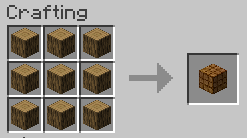
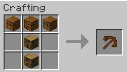

# Chunk Destroyer Tools

**_LET'S MAKE THE WORLD FLAT!_**

A minecraft mod that gives you a set of tools with volume effect.

## GIFs

<figure>
    
      <em>An example of volume mining with the Diamond Chunk Pickaxe</em>
</figure>

 
 

<figure>
    
    <em>An example of volume digging with the Diamond Chunk Shovel</em>
</figure>

 
 

<figure>
    
    <em>An example of volume chopping with the Diamond Chunk Axe</em>
</figure>

## Recipes

### Packed Blocks

The source material for building these tools are the Packed Blocks. A packed block is always crafted putting 9 blocks of the specific material for each tier into the crafting table.

<figure>
    
    <em>An example of Packed Block crafting with the Packed Log Block.</em>
</figure>

#### Available materials for packed blocks:

- Logs
- Stone
- Iron Block
- Gold Block
- Diamond Block
- Netherite Block

### Chunk Tools

After crafting these blocks, you'll be able to craft your chunk tools. All chunk tools use the same crafting shape as Minecraft default tools, only differing the material used to build them. 

<figure>
    
    <em>An example of Chunk Tool crafting with the Wooden Chunk Pickaxe.</em>
</figure>

#### Resources for crafting each tool

| Material | Stick | Head |
| ---- | ----- | ---- |
| Wood | Log | Packed Log Block |
| Stone | Stone | Packed Stone Block |
| Iron | Iron Ingot | Packed Iron Block |
| Gold | Gold Ingot | Packed Gold Block |
| Diamond | Diamond | Packed Diamond Block |
| Netherite | Netherite Ingot | Packed Netherite Block | 
      
## Tool Properties

Each tool has the same properties as the respective tool material of Minecraft default tools. However, as a volume tool, the chunk tools differ by their ranges.

### Ranges

| Material | Range (blocks) | Max Blocks Affected |
| -------- | -------------- | ------------------- |
| Wood | 3 | 27 |
| Stone | 7 | 343 |
| Iron | 17 | 4913 |
| Gold | 15 | 3375 |
| Diamond | 31 | 29791 |
| Netherite| 81 | 531441 |

## Thanks

I hope you enjoy playing with this mod. Don't forget to subscribe to [my YouTube channel](https://www.youtube.com/c/Acreditesequisernickoff/videos) for any new mods and to give this repository a star.

❤️ Made with love by Nickoff
